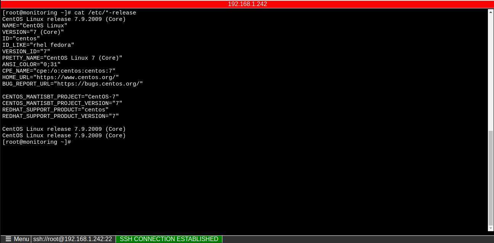

# remote-server

## Project Structure
#### - Front-end-remote-server (react) (https://github.com/thanhgit/front-end-remote-server)
#### - Back-end-remote-server (gin in golang) (https://github.com/thanhgit/back-end-remote-server)
#### - WebSSH2 (https://github.com/billchurch/WebSSH2)

## Quickly
### Start application
```bash
$ ./build-script.sh
```
### Clean application
```bash
$ ./clean.sh
```

## Remote server workflow
<div>

</div>

## API server backend
<div>

</div>

## UI of application 
<div>



</div>

## Technical Support or Questions
If you have questions or need help integrating the product please "thanh29695@gmail.com" instead of opening an issue
