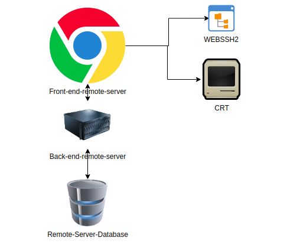
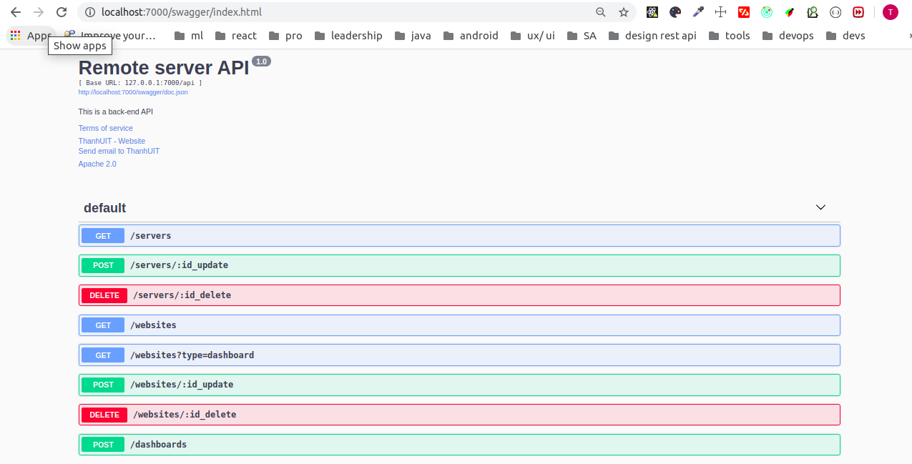
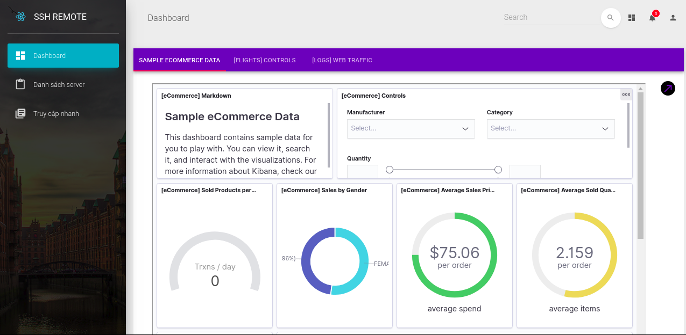
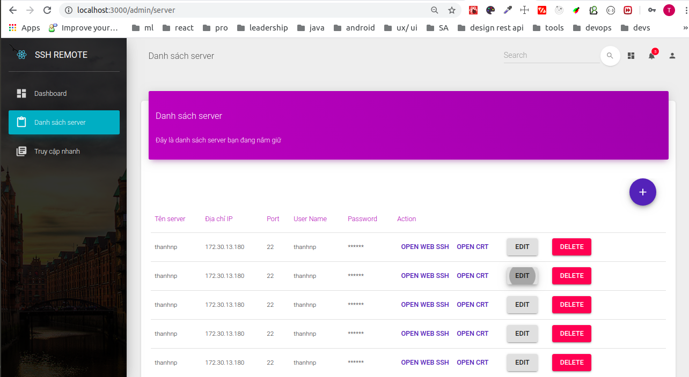
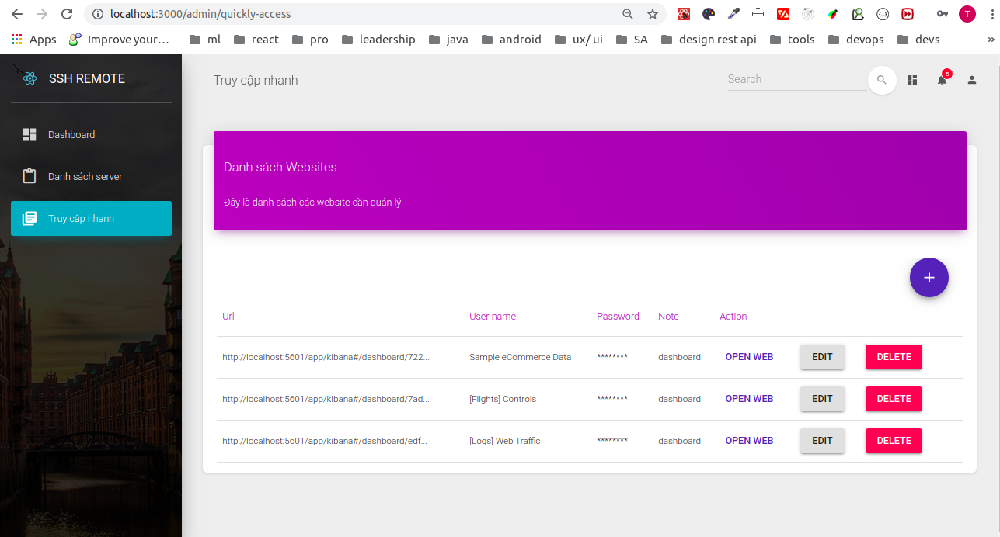

# remote-server

## Project Structure
### - Front-end-remote-server
### - Back-end-remote-server
### - WebSSH2 (https://github.com/billchurch/WebSSH2)

## Remote server workflow

## API server backend

## UI

