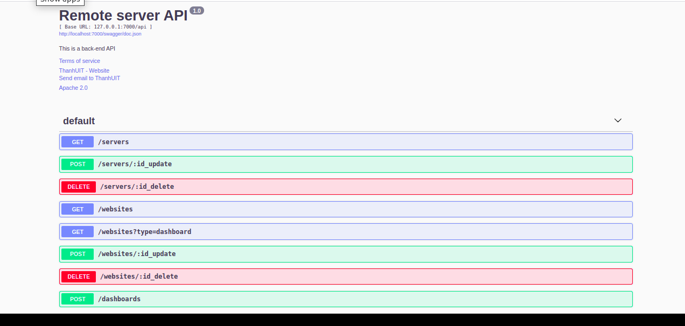

# remote-server
- ### demo
## Project Structure
#### - Front-end-remote-server (react) (https://github.com/thanhgit/front-end-remote-server)
#### - Back-end-remote-server (gin in golang) (https://github.com/thanhgit/back-end-remote-server)
#### - WebSSH2 (https://github.com/billchurch/WebSSH2)

## Quickly
### Start application
```bash
$ make start-server
```
### Stop application
```bash
$ make stop-server
```

### List applications
```bash
$ make list-server

make list-server
sh list.sh
------------docker-compose ps-----------------
               Name                             Command               State                 Ports              
---------------------------------------------------------------------------------------------------------------
front-end-remote-server_backend_1    /entrypoint.sh ./remote-server   Up      0.0.0.0:7000->7000/tcp           
front-end-remote-server_db_1         docker-entrypoint.sh mysql ...   Up      0.0.0.0:3306->3306/tcp, 33060/tcp
front-end-remote-server_frontend_1   npm start                        Up      0.0.0.0:3000->3000/tcp           
front-end-remote-server_nginx_1      /docker-entrypoint.sh ngin ...   Up      0.0.0.0:80->80/tcp               
front-end-remote-server_webssh2_1    /usr/local/bin/node index.js     Up      0.0.0.0:2222->2222/tcp           
------------Front-end IP----------------------
http://xxx.xxx.xxx.xxx

```

## Remote server workflow
<div>

</div>

## API server backend
<div>

</div>

## UI of application 
<div>


</div>

## Technical Support or Questions
If you have questions or need help integrating the product please "thanh29695@gmail.com" instead of opening an issue
